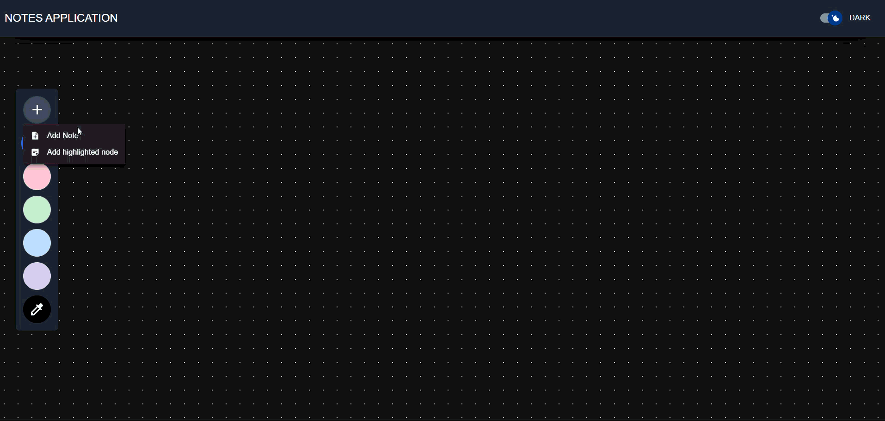

# React Notes app

React Notes application created with Vite, Tailwind, React and Typescript.

<h3>Features:</h3>

- Dark mode / light mode
- Color changes based on background color
- Add highlighted notes and mapped them on render
- Filtering by Highlighted or simple notes
- Drag and drop notes using the right preview drag and drop component
- Added notes filter by text search in content
- Responsive design
- Implemented localstorage to preserve the data
- Clear storage with timer

Demo:

- https://johnrusu.github.io/react-notes/
